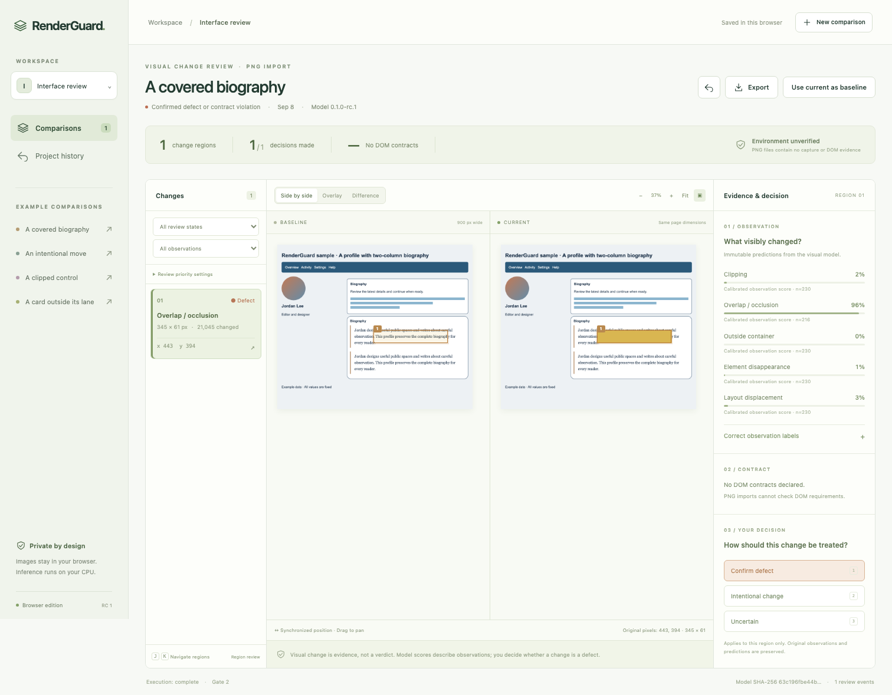

# RenderGuard

A local workbench for reviewing webpage visual changes with pixel evidence, a trained visual observation model, explicit layout contracts, and an auditable human decision.

[Open the browser demo](https://yeopbong.github.io/renderguard/) · [Candidate release](https://github.com/yeopbong/renderguard/releases/tag/v0.1.0-rc.1) · [Method and architecture](docs/architecture.md) · [Validation](docs/validation.md)



Create a project, save a baseline, capture a changed local page or import a PNG, inspect differences and model evidence, review each region, and export a self-contained report. Updating the baseline is a separate, reversible action. Original screenshots and predictions remain unchanged when a reviewer accepts an intentional redesign.

The browser demo runs the released ONNX model locally in a single-thread WebAssembly Worker. It supports PNGs, examples, persistent review decisions, and offline JSON/HTML reports. Images are not uploaded. URL capture, DOM constraints and explicit feedback training are available in the local application.

## Start locally

Requires Python 3.12, Node.js 22.12 or later, and pnpm 11.19.0. The setup downloads pinned dependencies and Chromium once. The versioned inference model is included in the repository; core processing then works without an external API.

```sh
git clone https://github.com/yeopbong/renderguard.git
cd renderguard
./scripts/setup.sh
./scripts/start.sh
```

Open **http://127.0.0.1:8765**. One local service serves the production frontend, API and background jobs. Projects are saved in `workspace/`; keep this directory private. To use a different workspace, pass `--workspace /path/to/private/reviews` to the start script.

The tested local platform is macOS arm64. CI also runs the key tests and browser build on Ubuntu; that does not establish full desktop installation support on every Linux distribution or on Windows.

On Linux, Chromium additionally requires operating-system libraries. Install these with `pnpm exec playwright install-deps chromium` after installing Node dependencies; this may require administrator privileges. The macOS setup does not need that extra system-library step.

## What a result means

- **Observation:** a visible symptom such as clipping, overlap, border crossing, disappearance or displacement. The model receives only image crops and image-derived geometry.
- **Contract:** a previously declared requirement such as visible presence, containment or non-overlapping border boxes. Missing or ambiguous selectors are inconclusive.
- **Decision:** Confirm defect, Intentional change, or Uncertain. Corrected observation labels are saved separately and only used by an explicit training action.

A visual change is not automatically a defect. Scores are not bug probabilities. Low scores never approve an unreviewed change. A gate of 0 means only that the declared policy has no blocking items. Missing models, failed captures, cancellation, incomparable inputs and unchecked required contracts cannot become a successful no-change result.

## Research scope and limitations

The main experiment uses 1,728 original synthetic screenshot pairs from 24 grouped layout families, with disjoint train, development, calibration and test sources. Nine paired models were actually trained across three fixed seeds. On the synthetic test families, the visual models outperform image-difference statistics. These families were already observed before a full-page rendering correction, so their corrected results are regression evidence rather than an untouched final test. Full class counts, baselines, calibration, failures and source hashes are in [the experiment documentation](docs/experiments.md).

A fresh, independently authored final holdout was frozen before evaluating the corrected model: 54 rendered pairs from three new structures, with 48 unique pairs used for metrics. It shows useful overlap and displacement recognition, but misses every clipping positive and produces many border-crossing false alarms. The earlier challenge and its failures are also retained as historical evidence. RenderGuard is a research review assistant for the tested scene domain, **not an automatic production release gate**. Small details may disappear in 96-pixel model crops. DOM checks use measured rectangular geometry and do not prove clickability or arbitrary actual occlusion. PNG imports have unverified capture conditions.

Same-width long pages can differ in height. Width mismatches are rejected. Masked areas are explicitly excluded and recorded. See [architecture](docs/architecture.md) for coordinate rules, resource limits and gate semantics, [data](docs/data.md) for supervision limits, and [model](docs/model.md) for training and weight licensing.

## Reproduce a complete case

Start the included local development pages in a terminal:

```sh
.venv/bin/python examples/serve.py
```

In another terminal, analyze the main case and evaluate its gate separately:

```sh
.venv/bin/python -m server.cli --capture examples/main/capture.json --output workspace/main-report.json
.venv/bin/python -m server.gate workspace/main-report.json
```

The analysis command succeeds when evidence is generated. The main case gate exits 2 because declared geometry is violated. Use `examples/intentional/capture.json` for an intended layout move (gate 1 until reviewed), or `examples/failure/capture.json` for a missing required selector (gate 3). These cases can also be entered through the local workbench using their before/after URLs and contracts. HTML exports open directly offline.

## Development and experiments

```sh
pnpm prepare:web
pnpm build
node --import tsx --test tests/core*.test.ts
.venv/bin/python -m pytest -q
node --import tsx --test tests/browser*.test.ts
./scripts/benchmark.sh
```

Full training is separate from routine CI. It regenerates the authored corpus and uses verified generic pretrained weights before head warmup and genuine encoder fine-tuning. Feedback training is explicit, compares against retained development data, invalidates calibration, and requires manual activation. Previous model versions remain available for rollback. See [release artifacts and offline use](docs/releases.md) for downloads, checksums, retained experiment evidence, and model restoration.

## Licenses

Application code: [MIT](LICENSE). Original authored scene content and generated images: CC0-1.0. The model derives from explicitly Apache-2.0 licensed generic MobileNetV3 weights; see [model license](artifacts/MODEL-LICENSE) and [third-party notices](THIRD_PARTY_NOTICES.md). The upstream ImageNet provenance is distinct from this project's generated scene data.
