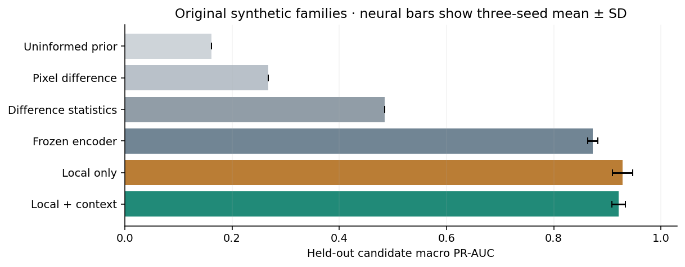
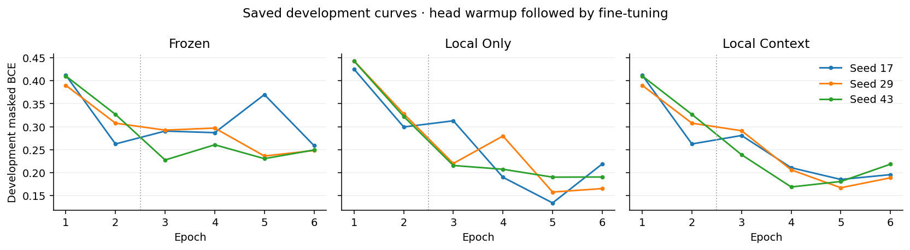
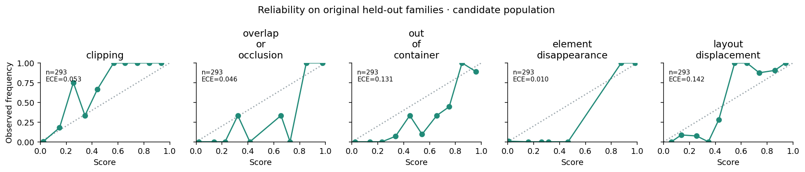
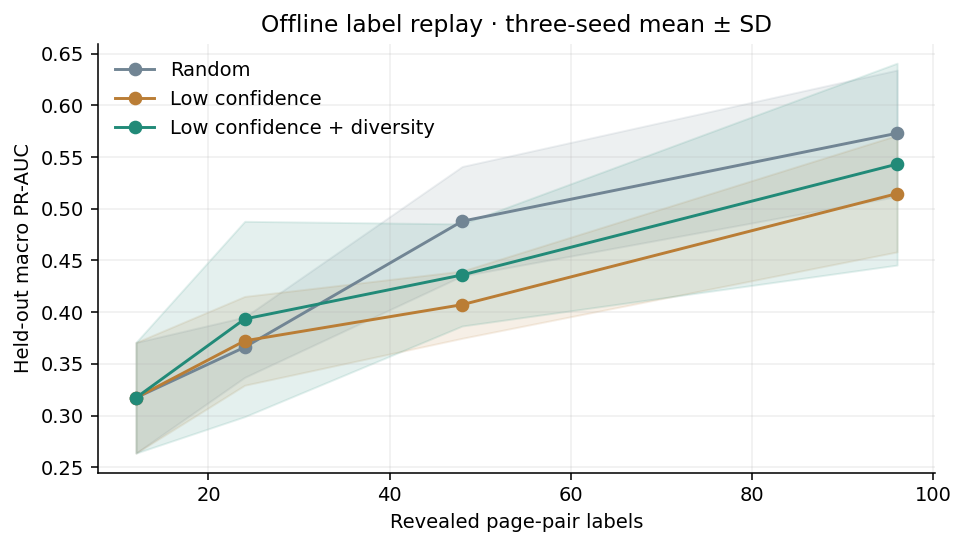

# Experiment results

Saved results for the released local + context model. The final structural holdout missed every clipping-positive page and produced many boundary-crossing false positives; occlusion and displacement transferred better. Original records remain in [artifacts](../artifacts).

The original 24-family evaluation was rerun after correcting full-page screenshots, with unchanged splits and training recipe. Those families had already been observed. [Viewport-only results](../artifacts/viewport-only-audit/) and the earlier challenge belong to the superseded model. The separate final holdout below was evaluated after freezing the corrected model.


## Final structural holdout

The corrected model was evaluated on 54 newly authored pairs (48 unique image pairs) from 3 structurally independent fixture sources. The release thresholds were frozen before predictions. These results did not change the model, thresholds or labels.

| Observation | Known pages | Positive pages | F1 | Average precision | Missed positives |
|---|---:|---:|---:|---:|---:|
| clipping | 45 | 9 | 0.000 | 0.137 | 9 |
| overlap_or_occlusion | 45 | 9 | 0.889 | 0.989 | 1 |
| out_of_container | 45 | 6 | 0.091 | 0.149 | 5 |
| element_disappearance | 48 | 3 | 0.444 | 0.333 | 1 |
| layout_displacement | 48 | 18 | 0.703 | 0.889 | 5 |

Clipping missed every positive page; boundary crossing produced many false positives. [Raw holdout results](../artifacts/final-holdout-results.json) include per-family scores and both threshold policies.

## Dataset and training

The corpus has 1,728 Chromium PNG pairs in 24 source families: 1008 training, 288 development, 216 calibration, and 216 test. The application generates candidates; rendered observations supply labels, with unknown supervision masked. See [Data and supervision](data.md).

The release model uses seed 29, selected by development macro PR-AUC 0.9562. Training source: `fb3136c62f0d902835ac12b5292e043dcaf7fc83`. Training uses two head-warmup epochs and four encoder-tuning epochs, with AdamW reset each epoch and frozen BatchNorm statistics. Comparisons use seeds 17, 29 and 43 with the same splits and labels; see [training configuration](../artifacts/training-config.json).

## Candidate classification

| Method | Held-family macro PR-AUC | Repeats |
|---|---:|---:|
| Uninformed training prior | 0.1618 | Deterministic |
| Pixel difference density | 0.2672 | Deterministic |
| Difference statistics + logistic classifier | 0.4842 | Deterministic |
| Frozen generic visual features | 0.8725 ± 0.0094 SD | 3 seeds |
| Fine-tuned local crops | 0.9284 ± 0.0191 SD | 3 seeds |
| Fine-tuned local + context | 0.9209 ± 0.0124 SD | 3 seeds |



Local-only has a slightly higher mean than local + context, within the variation across seeds. The release retains local + context. [Per-seed metrics and losses](../artifacts/experiments.json) retain every run.

| Observation | Known candidates | Positive | Precision | Recall | F1 | PR-AUC |
|---|---:|---:|---:|---:|---:|---:|
| clipping | 293 | 36 | 0.857 | 0.667 | 0.750 | 0.915 |
| overlap_or_occlusion | 293 | 36 | 0.897 | 0.972 | 0.933 | 0.992 |
| out_of_container | 293 | 63 | 0.434 | 1.000 | 0.606 | 0.878 |
| element_disappearance | 293 | 18 | 1.000 | 0.889 | 0.941 | 0.910 |
| layout_displacement | 293 | 84 | 0.821 | 0.929 | 0.872 | 0.929 |

The selected model's macro PR-AUC is 0.9248; its 500-resample source-family percentile interval is [0.9073, 0.9704]. This interval uses only three authored test families.



## Candidate coverage and complete-system recall

There are 147 positive observation regions across 216 held-family pairs. Candidate recall is 1.000 at 10% ground-truth coverage and 0.796 at 50% coverage: respectively 0 and 30 regions are missed. Mean maximum coverage is 0.809, while mean maximum tightness is 0.735. The average candidate count is 1.356 per pair, p95 6.0, maximum 7; 58 pairs have no candidate.

Ground-truth boxes join before/after element extents. The 10% association is permissive; coverage and tightness are reported separately.

| Observation | All positive regions | Captured | Missed | Complete-system recall |
|---|---:|---:|---:|---:|
| clipping | 36 | 24 | 12 | 0.667 |
| overlap_or_occlusion | 36 | 35 | 1 | 0.972 |
| out_of_container | 54 | 54 | 0 | 1.000 |
| element_disappearance | 18 | 16 | 2 | 0.889 |
| layout_displacement | 75 | 69 | 6 | 0.920 |

## Review budgets

Pages rank by maximum candidate observation score. Budgets include candidate-free pages and measure capture of observation-bearing pages.

| Method | Top 10% capture | Top 25% capture | Top 50% capture |
|---|---:|---:|---:|
| local_context | 22/129 (0.171) | 54/129 (0.419) | 108/129 (0.837) |
| difference_statistics | 20/129 (0.155) | 46/129 (0.357) | 92/129 (0.713) |
| pixel_difference | 22/129 (0.171) | 45/129 (0.349) | 91/129 (0.705) |
| frozen | 22/129 (0.171) | 54/129 (0.419) | 108/129 (0.837) |
| local_only | 22/129 (0.171) | 54/129 (0.419) | 108/129 (0.837) |

DOM contracts use separate challenge and integration fixtures; they are not included in the visual classification metrics.

## Calibration

Calibration uses three separate families. A class needs at least 15 known positives and 15 known negatives; other outputs stay uncalibrated. The calibration target is observation frequency on these synthetic candidates.

| Observation | Calibration n | Positive / negative | Status | Held-family Brier | Held-family ECE |
|---|---:|---:|---|---:|---:|
| clipping | 230 | 35 / 195 | calibrated | 0.0424 | 0.0532 |
| overlap_or_occlusion | 216 | 34 / 182 | calibrated | 0.0147 | 0.0460 |
| out_of_container | 230 | 69 / 161 | calibrated | 0.0826 | 0.1307 |
| element_disappearance | 230 | 24 / 206 | calibrated | 0.0095 | 0.0101 |
| layout_displacement | 230 | 93 / 137 | calibrated | 0.0787 | 0.1421 |



Calibration metrics cover generated candidates. [Full bin counts](../artifacts/model-results.json) remain available; missed candidates are outside these measurements.

## Domain and type exclusions

Secondary probes use seed 107. Training/epoch selection uses light English variants 0 and 2; dark English uses held-family variants 1 and 3. Japanese and Chinese text is separately authored on held structures. Chinese changes both script and theme.

| Probe domain | Macro PR-AUC | Macro F1 |
|---|---:|---:|
| light_english | 0.9053 | 0.8132 |
| dark_english | 0.5175 | 0.4165 |
| ja | 0.8245 | 0.7684 |
| zh | 0.6074 | 0.5580 |

The symptom-exclusion configuration removes 146 overlap-positive training page pairs before training. The excluded class has PR-AUC 0.1250, recall 0.000, and F1 0.000. Its score is uncalibrated and the excluded class has no positive task supervision.

## Offline label replay

The replay pool contains 702 candidate-bearing training page pairs. Each strategy begins with the same 12 labeled pages per seed and uses budgets 12, 24, 48, and 96. Selecting a page reveals its existing labels. All strategies use the same frozen encoder, projection, logistic heads, seeds and update schedule. Candidate-free pages are excluded from this labeling pool.

Calibration-label cost is 0; selection uses uncalibrated scores. The separate development-label cost is 198 candidate-bearing page pairs. Development labels are outside the pool budget; human time was not measured.

| Strategy | 12 pages | 24 pages | 48 pages | 96 pages |
|---|---:|---:|---:|---:|
| random | 0.3172 | 0.3661 | 0.4879 | 0.5730 |
| uncertainty | 0.3172 | 0.3723 | 0.4073 | 0.5147 |
| uncertainty_diversity | 0.3172 | 0.3934 | 0.4360 | 0.5432 |



Active selection did not consistently beat random selection. Records retain selected page IDs and candidate counts at each step.

## Runtime and numerical parity

Measured on macOS-26.5.2-arm64-arm-64bit with MPS training and CPU ONNX inference: full scene generation took 139.87 s and all nine primary neural comparisons plus associated evaluation took 102.70 s. The ONNX file is 6,184,503 bytes. Its measured cold load was 27.64 ms, first inference 7.05 ms, warm median 6.49 ms and p95 6.78 ms over 40 trials at batch 1. Each input has four 96 × 96 RGB crops plus 12 geometry values.

On 24 real candidate inputs, maximum deployment-fused PyTorch/ONNX logit error was 6.4e-05, score error 6.9e-06, with 0 threshold disagreements and ranking agreement True. The tolerance remains 1e-4. The raw, unfused float32 PyTorch comparison separately exceeded that initial logit budget (about 1.23e-4); its calibrated score difference stayed below 7.1e-6 with zero threshold differences. The raw comparison remains in [numerical diagnostics](../artifacts/numerical-batch-diagnostic.json). The ONNX graph contains no BatchNorm nodes, and standard PyTorch Conv/BN fusion independently agrees with its exported convolution weights within float32 rounding: maximum absolute difference 7.63e-06, maximum relative difference 2.29e-07, and maximum distance 2 float32 ULPs. Browser parity tests cover decoded pixels, candidates, tensors, graph output and ranking.

[Preprocessing timings](../artifacts/preprocessing-timing.json) cover PNG decode, candidates and tensors; [end-to-end timings](../artifacts/end-to-end-timing.json) include process startup, disk transfer and CPU inference. URL capture and UI rendering are separate.

## Reproduction

```sh
node ml/generate.mjs
python -m ml.prepare
python -m ml.train --device mps --epochs 6
python -m ml.replay --device mps
node --import tsx ml/stress-generate.mjs
python -m ml.stress --device mps
python -m ml.numerical
python -m ml.evaluate
node --import tsx ml/benchmark.mjs
python -m ml.benchmark
python -m ml.feedback --build-buffer
python -m ml.figures
python -m ml.report
```

Install browser dependencies first and use `--device cpu` where MPS is unavailable. These commands regenerate data and training results; routine tests do not require them.
